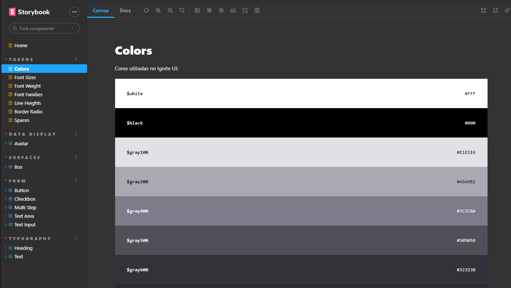

<h1 align="center" style="color: rgba(68, 131, 97, 1);">Design System - Ignite Call</h1>

    Esse projeto foi desenvolvido durante o módulo 5: <i>Construindo Design System</i>, no bootcamp <a href="https://lp.rocketseat.com.br/ignite?&&" style="color: rgba(68, 131, 97, 1); text-decoration: underline;">Ignite</a> (Rocketseat), com o objetivo de construir um <strong>Design System</strong> do zero, documentando os componentes React e descobrir diversas ferramentas que vão nos ajudar desde a implementação do DS até a sua publicação.
  

  <a href="#-tecnologias-e-bibliotecas">Tecnologias</a>&nbsp;&nbsp;&nbsp;|&nbsp;&nbsp;&nbsp;
  <a href="#-sobre-o-projeto">Sobre</a>&nbsp;&nbsp;&nbsp;|&nbsp;&nbsp;&nbsp;
  <a href="#-layout">Layout</a>&nbsp;&nbsp;&nbsp;|&nbsp;&nbsp;&nbsp;
  <a href="#-como-executar">Como executar</a>

  

 

  

 

## ✏️ Tecnologias e bibliotecas

Para a construção do projeto, foram utilizadas as seguintes tecnologias:

- [ReactJs](https://reactjs.org/)
- [TypeScript](https://www.typescriptlang.org/)
- [Stitches](https://stitches.dev/)
- [Storybook](https://storybook.js.org/)
- [Turbo Build](https://turbo.build/repo/docs/handbook/publishing-packages/versioning-and-publishing)
- [Changesets](https://github.com/changesets/changesets)
- [ESLint](https://github.com/changesets/changesets)
- [TSUP](https://tsup.egoist.dev/)

 

---

## ✨ Sobre o projeto

Um dos desafios quando falamos de desenvolvimento de produtos digitais é manter a consistência, precisão e padronização dos mesmos conforme as equipes mudam ou crescem. O Design System pode ser uma ferramenta útil para a situação.

<b>Design System</b> é um documento vivo com padrões visuais e códigos unificando as duas práticas, disponibilizado para toda a equipe de design e desenvolvimento para, além de tudo, garantir uniformidade na experiência final do usuário. Ecossistema de bibliotecas instaláveis, com componentes programados e padrões semânticos de design, que reúne padrões de comportamentos.
- <i>Product serving products</i>

Através de um monorepo (repositório único contendo projetos distintos com relações bem definidas), o Design Syestem do Ignite Call contém os seguintes pacotes:

- <b>Tokens</b> -> A menor parte do estilo. Variáveis nomeadas que armazenam atributos de design visual, que não dependem de uma tecnologia específica (agnóstico). São coisas como cores, espaçamentos e tamanhos, que quando sozinhos parecem não ter muita importância, mas que em conjunto são muito relevantes para determinar a consistência de um produto;

- <b>Storybook</b> -> Permite o desenvolvimento e projeção das interfaces de forma, rápida, isolada e independente. Podemos interagir com os componentes criados no pacote React, definindo diferentes estados, documentando seu comportamento;

- <b>React</b> -> Pacote que contém nossos componentes a serem reutilizados. Construído com as tecnologias ReactJs, Typescript, Stitches e Radix, o pacote é servido por Tokens, e serve os produtos que utilizarão os componentes. Obs: React foi instalado como uma dependência de desenvolvimento, esperamos que as aplicções que utilizem o pacote, já tenham React instalado;

- <b>ESLint</b> -> Pacote com confiurações específicas, para auxiliar a escrita do código nos pacotes que são servidos por ele.

 

### TSUP

Ferramenta para processo de conversão do nosso código em um pacote JavaScript que poderá ser carregado por outros aplicativos.
- Converte para diversos formatos, assim, aplicativos com diferentes suportes poderão consumir (aplicações mais recentes e mais antigas);
- Não limitamos quem vai consumir nosso pacote;
- Mais performático, utiliza <i>esbuild</i>.

 

### TurboRepo

Ferramenta para processo de conversão do nosso código em um pacote JavaScript que poderá ser carregado por outros aplicativos.
- Converte para diversos formatos, assim, aplicativos com diferentes suportes poderão consumir (aplicações mais recentes e mais antigas);
- Não limitamos quem vai consumir nosso pacote;
- Mais performático, utiliza <i>esbuild</i>.

 

---

## 💄 Layout

O layout da aplicação foi desenvolvido e forneciso pela equipe da Rocketseat.

<a href="https://www.figma.com/file/Rwg14Ktx1PYYCTfDkYXERW/Ignite-Call-(Community)?node-id=0%3A1&t=S3aoKiePYLLuNsK1-0" style="color: rgba(68, 131, 97, 1); text-decoration: underline;">Clique aqui</a> e acesse o conteúdo!

 

---
